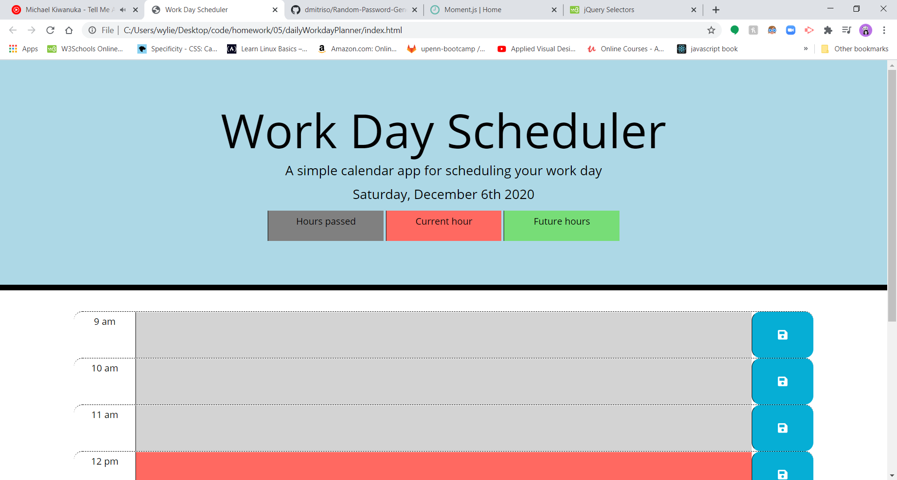
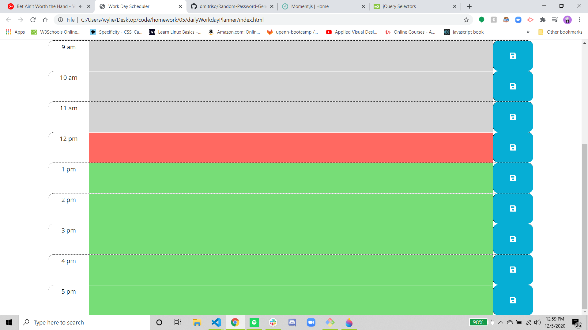
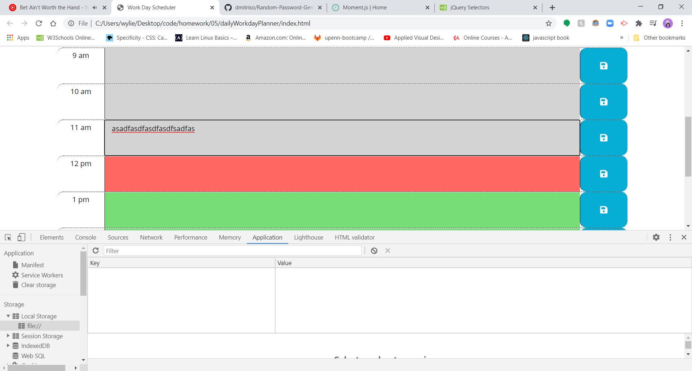
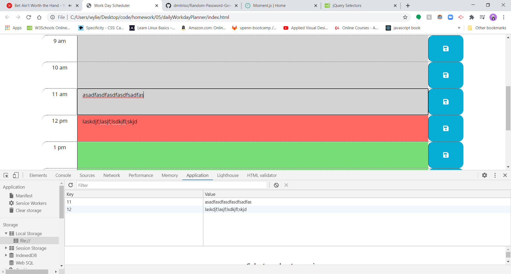

# dailyWorkdayPlanner

## Description

We were asked to put together a daily work scheduler for a busy employee.  We were told to use Jquery to put the application together. It will be able to tell you what the current hour and date is. For easy of use and readability is color coded.  There are three different colors to differentiate between past(gray), present(red), and future(green). It is only intended to be used for a regular work day from the hours of 9am to 5pm.  The user is able to input data in to a specified hour block save it for later use. The application makes use local storage, so that the user can come back to the page whenever and still see what tasks are on the schedule. ______here is for the Delete Key______. 

## Javascript

Javascript explanation

### Current day Display
We start of with using document.ready with an anonymise function to put all of our code in.  The ready method makes sure that pages html loads before we start to run our javascript.  I started by grabbing the date using both Jquery and Moment.js to print out the date to the jumbotron in the html. The element is grab using $ and an id. It applies the text method to put in the text content to the page follow by using moment.format to print out dddd(the day of the week), MMMM(Current month), do(the number day of the month), and YYYY(the current year).

### Global Variable
I set a global variable of currentHour, so that we are able to use it later in a function.

### Getting Local Storage
At this point in the code I want to grab whatever is in local storage. Using $ I grab an item that has both id of that time block that also has class of in that time block.  The class is actually a child of the the id.  From here I want to get the .val of what is in local storage with the key value of the that particular time block. It does nothing if there is nothing in local storage, but grabs it if there is something there.  I use this particular line for every time-block that is listed on the page.  

### Save Button Function
Next is the functionality of the save button. Jquery is used to select the class of saveBtn, .on is added to it that fires off a function when it is clicked.  The first thing that occurs is that we assign a variable.  That variable is called userTask,  $(this) refers to the save button because that is what on method was used for.  It then looks at the sibling method, that looks for a sibling with the set parameter. The parameter that I had it set to was a class of description. .val is added lastly cause we want to find the user input.  If .val was passed a parameter, it would pass that value instead of user input.  Next another variable with the name of time is set.  Using the .parent, it looks for the parent element of the button($(this)). I want to get the id attribute of the parent element by using .attr("id"). All of these things chained together sets time value to the id.  I created these two variable to setup local storage.  So the last line of this click function sets the value of userTask to the key of time, the id of the time block.

### Time Updater function
This function is used to keep our planner in realtime.  It starts by using a forEach in Jquery notation (.each). It will take any element with a class of time-block and run the following function on it. First thing I do is declare a variable of blockHour.  It is set to an integer(using parseInt) of this specific time-block's id.  After that variable is declared, The function moves into IF statement.  The IF checks if the local variable(time of the time-block) is less than the global variable(the current time). If it is true then we will add a style-class to the child element with the class of description. If not it checks our next conditional of if the values are equal, that is true it will remove the class of past and add a class of present.  Lastly if neither of the previous statements are true, it will remove two classes (past, present) and add the class of future.

### Delete button

## HTML

## Screen Shots

Screen shot of application

;
;
;

## Credits

* [Stack Overflow general research](https://stackoverflow.com/); 
* [W3schools general research](https://www.w3schools.com/default.asp);
* [Mdn web docs general research](https://developer.mozilla.org/en-US/);
* [Bootstrap general research](https://getbootstrap.com/);
* [AskBCS]
* [Moment.js for time](https://momentjs.com/);
* [JQuery documentation](https://api.jquery.com/);